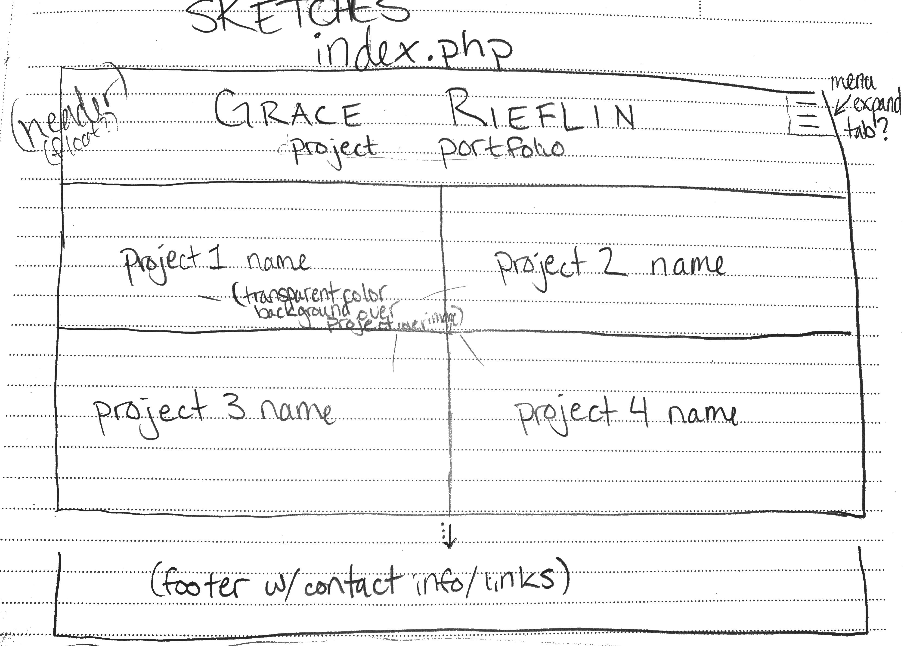
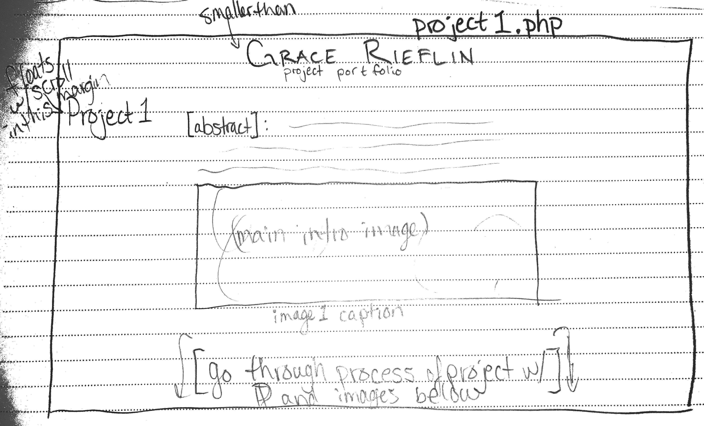
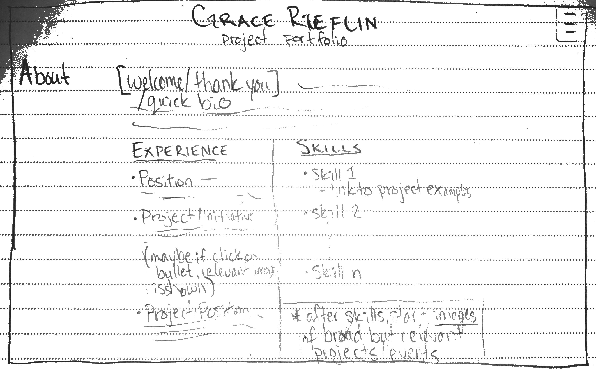
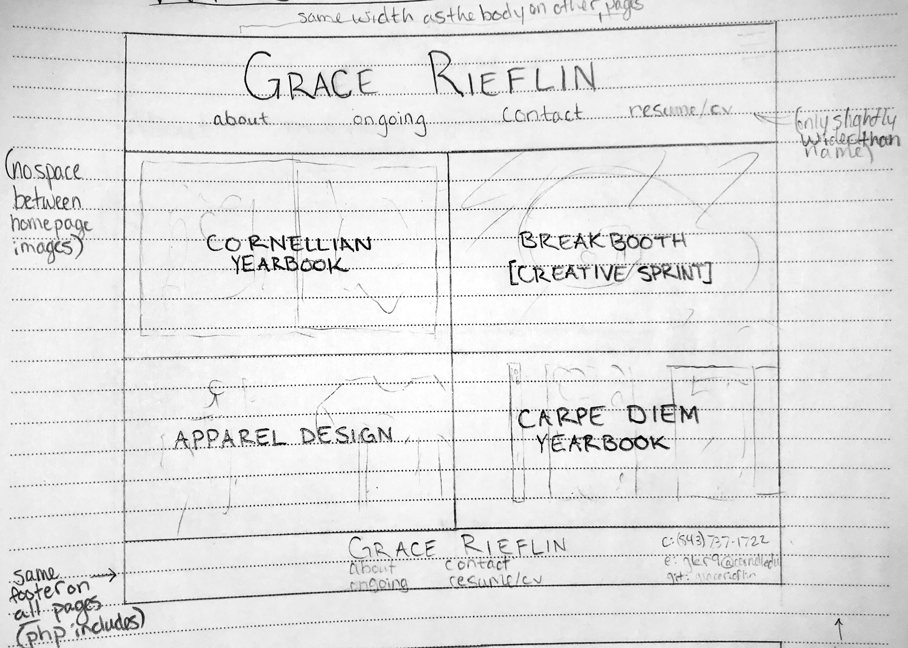
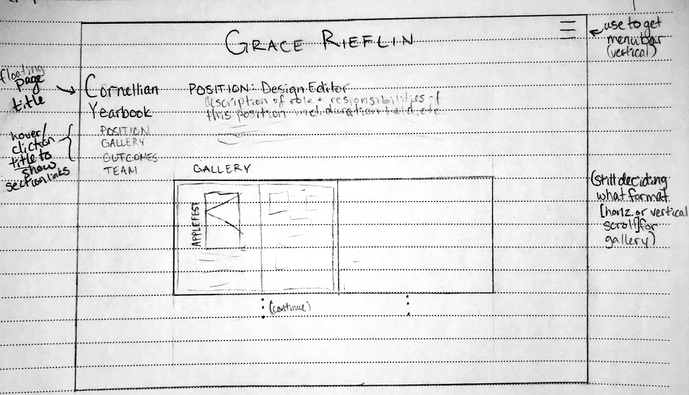
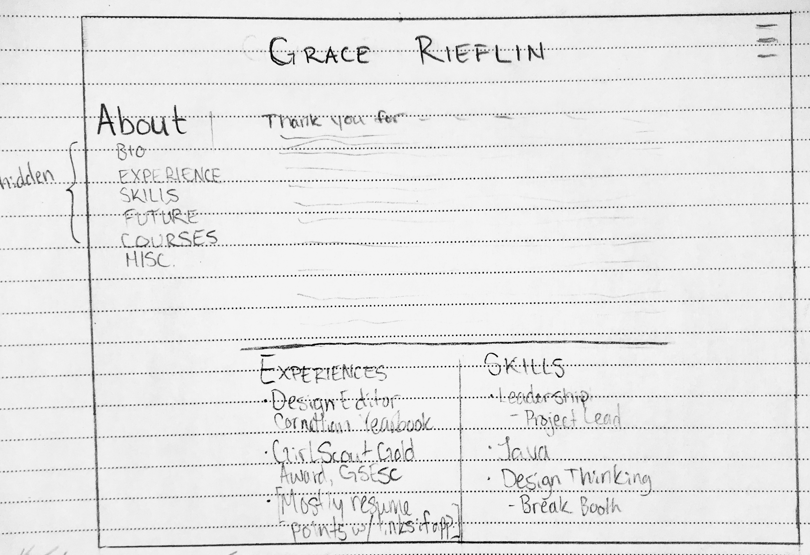

# Project 1, Milestone 1 - Design & Plan

Your Name: Grace Rieflin

## Markdown

[**Delete this section before you submit your assignment.**]

This is a Markdown file. All written documents that you will submit this semester will be Markdown files. Markdown is a commonly used format by developers and bloggers. It's something that you should know.

The following links are Markdown references:
* <https://guides.github.com/features/mastering-markdown/>
* <https://github.com/adam-p/markdown-here/wiki/Markdown-Cheatsheet>

When writing your Markdown file in Atom. Open the command palette and search for **Markdown Preview: Toggle**. This will open up a panel in Atom where you can preview your formatted Markdown file.

This is how your insert images into your Markdown documents:

**Tip: The above example image could double for both a sketch and a wireframe.**

## 1. Persona

I've selected Abby as my persona.

I've selected my persona because she is a professional adult with a background more in the business-side of things, as opposed to being particularly tech or design-savvy, so by designing my site with this persona in-mind, I will be able to make my content more easily-understood by more audiences than just those who hold positions that I could see myself in.

## 2. Sketches

Because Abby likes to be able to get a breadth of information before acting, I designed the home page (index.php) of my site to show representative images and titles for my projects and experiences as the links to each project's individual page. By offering both titles and cover-photo-like images as the site's introduction to its more in-depth content, audiences like Abby will be able to get a feel for both the type of work and the quantity of projects I have done, and can _then_ select where she'd like to go next, after just scrolling on the home page. Also, I've included an abstract on the project pages so that, before committing to exploring the page's content further, the audience can read-up on the basic TL;DR of the project.

###### index.php

###### project1.php

###### about.php

## 3. Wireframes

###### index.php

###### project1.php

###### about.php

## 4. Coding Plan & Pseudocode

The header for each page that is not the home (index) page will have a uniform PHP includes header that will strongly resemble that on the home page, as to create a feeling of continuity between pages.
All pages will also _include_ the same footer, including my name, links to the same pages as in the header (on the home page), and further contact information.

**My User defined function**: Creating a list of a page's sections (as links to each section) to be rendered in the side margin.

At the top of each content page file, have an array of all of the page's sections. 
  The array should be associative:
  - key: section ID (e.g. #position)
  - value: section title (e.g. "Position")

``function print_sections (sections)`` 
>``for each section in sections`` 
  >>``create an <a> tag to link to the section ID (key)`` 
  >>``print link on page as the section title (value)``

[Under the title (left margin, likely), create a vertical list of the section titles, all of uniform styling.
  - for each section in sections
    - print list of titles as links to the section, using the section ID.]
